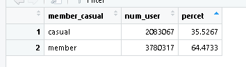
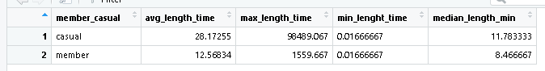

# Data-Analytics-Google-Bike-Share-Cyclistic

<p align="center">
  
</p>

## Análise do Uso Compartilhado de Bicicletas en Chicago, USA: Estudo de Caso da Empresa Cyclistic
**Analises de dados usando R e RStudio.**
*Coursera-Google Data Analytics professional Certificate*

## 📑 Conteudo do processo de Análise 
* [Pergunta Empresarial](#perguntar)
* [Preparacão dos Dados](#preparar)
* [Processamento](#processar)
* [Análises](#analizar)
* [Visualização](#visualizar)
* [Ação](#Agir)


#### Cenário
* Você é um analista de dados júnior que trabalha na equipe de analistas de marketing da Cyclistic, uma empresa de compartilhamento de bicicletas em Chicago. O diretor de marketing acredita que o sucesso futuro da empresa depende da maximização do número de planos anuais contratados. Portanto, sua equipe quer entender como os ciclistas casuais e os membros anuais usam as bicicletas da Cyclistic de forma diferente. A partir desses insights, sua equipe criará uma nova estratégia de marketing para converter passageiros casuais em membros anuais. Mas, primeiro, os executivos da Cyclistic devem aprovar suas recomendações que, portanto, devem ser apoiadas com insights de dados convincentes e visualizações de dados profissionais


## Personagens e equipes
  ●	Cyclistic: Um programa de compartilhamento de bicicletas que conta com mais de 5.800 bicicletas e 600 estações de compartilhamento. A Cyclistic se diferencia por também oferecer bicicletas reclináveis, triciclos manuais e bicicletas de carga, tornando o compartilhamento de bicicletas mais inclusivo para pessoas com deficiência e ciclistas que não podem usar uma bicicleta padrão de duas rodas. A maioria dos ciclistas opta por bicicletas tradicionais; cerca de 8% dos motociclistas usam as opções assistivas. Os usuários da Cyclistic são mais propensos a pedalar por lazer, mas cerca de 30% utilizam as bicicletas para se deslocarem ao trabalho diariamente.
  ●	Lily Moreno: Diretora de marketing e sua gerente. Lily é responsável pelo desenvolvimento de campanhas e iniciativas de promoção do programa de compartilhamento de bicicletas. As campanhas podem incluir e-mail, mídias sociais e outros canais.
  ●	Equipe de análise de marketing da Cyclistic: Uma equipe de analistas de dados responsáveis por coletar, analisar e relatar dados que ajudam a orientar a estratégia de marketing da Cyclistic. Você se juntou a essa equipe há seis meses e tem estado ocupado aprendendo sobre a missão e os objetivos de negócios da Cyclistic – e como você, como analista de dados júnior, também pode ajudar a Cyclistic a alcançá-los.
  ●	Equipe executiva da Cyclistic: A equipe executiva notoriamente detalhista decidirá se aprova o programa de marketing recomendado.
 

## Sobre a empresa
  Em 2016, a Cyclistic lançou uma oferta bem-sucedida de compartilhamento de bicicletas. Desde então, o programa cresceu para uma frota de 5.824 bicicletas com rastreamento geográfico e bloqueio dentro de uma rede de 692 estações em Chicago. As bicicletas podem ser desbloqueadas em uma estação e devolvidas em qualquer outra estação do sistema a qualquer momento.

  Até agora, a estratégia de marketing da Cyclistic baseava-se na conscientização geral e no apelo a amplos segmentos de consumidores. Uma abordagem que ajudou a tornar essas coisas possíveis foi a flexibilidade de seus planos de preços: passes de viagem única, passes de dia inteiro e planos anuais. Os clientes que adquirem passes de viagem única ou de dia inteiro são chamados de passageiros casuais. Os clientes que adquirem planos anuais são membros Cyclistic.

  Os analistas financeiros da Cyclistic concluíram que os membros anuais são muito mais lucrativos do que os passageiros casuais. Embora a flexibilidade de preços ajude a Cyclistic a atrair mais clientes, Lily Moreno acredita que maximizar o número de membros anuais será a chave para o crescimento futuro. Em vez de criar uma campanha de marketing voltada para novos clientes, ela acredita que há uma boa chance de converter passageiros casuais em membros. Ela observa que os ciclistas casuais já estão cientes do programa Cyclistic e escolheram a Cyclistic para suas necessidades de mobilidade.

  A Lily estabeleceu um objetivo claro: criar estratégias de marketing destinadas a converter passageiros casuais em membros anuais. Para fazer isso, no entanto, a equipe de analistas de marketing precisa entender melhor como os membros anuais e os passageiros casuais diferem, por que os passageiros casuais iriam querer adquirir um plano e como a mídia digital poderia afetar suas táticas de marketing. A Lily e sua equipe estão interessados em analisar os dados históricos de trajetos de bicicleta da Cyclistic para identificar tendências.

## 3 Perguntar
Três perguntas nortearão o futuro programa de marketing:
1.	Como os membros anuais e os ciclistas casuais usam as bicicletas da Cyclistic de forma diferente?
2.	Por que os passageiros casuais iriam querer adquirir planos anuais da Cyclistic?
3.	Como a Cyclistic pode usar a mídia digital para influenciar os passageiros casuais a se tornarem membros?
 

A Lily lhe apresentou a primeira pergunta a ser respondida: Como os membros anuais e os ciclistas casuais usam as bicicletas da Cyclistic de forma diferente?

Você criará um relatório com as entregas a seguir:
1.	Uma declaração clara da tarefa de negócios
2.	Uma descrição de todas as fontes de dados usadas
3.	Documentação de qualquer limpeza ou manipulação de dados
4.	Um resumo da sua análise
5.	Como justificar visualizações e descobertas-chave
6.	Suas três principais recomendações com base em sua análise

Preparar Selecionado dados historicos dos ultimos 12 meses (janeiro de 2023 a janeiro de 2024), os dados foram fornecidos por Motivar International Inc, sendo dados publicos. Os dados pessoais dos usuarios sâo anonimizado.

## Preparar

Obs(caso você esteja tendo problemas na hora de executar o
Knit, erro UTF-8 caracteres especiais ) Verifique o arquivo de entrada:
Certifique-se de que o arquivo R Markdown esteja codificado em UTF-8.
Você pode verificar isso no RStudio, indo para File &gt; Reopen with
Encoding &gt; UTF-8. Remova caracteres especiais:(voce vai ver que onde
era para aparecer Exemplo “está”" vai aparecer “est?” ) Se o arquivo
contiver caracteres especiais não reconhecidos pelo UTF-8, tente
removê-los ou substituí-los por uma versão UTF-8 compatível. Use
stringAsFactors = FALSE: Ao ler dados em R, certifique-se de usar
stringAsFactors = FALSE para evitar a conversão automática de strings em
fatores, o que pode causar problemas de codificação.

``` r
library(tidyverse) #helps dados de wrangle
```

``` r
library(lubridate) #helps Atributos de data de de biblioteca (lubridato)
library(ggplot2) #helps visualizar dados
```

``` r
setwd("F:\\vizualixacao dados Cyclistic 2024")
```

\#usei F:\\ no chamado do local onde estão os dados porque ele da erro
usando só , o sistema acha que é um caracter especial.

Preparar Selecionado dados historicos dos ultimos 12 meses (janeiro de
2023 a janeiro de 2024), os dados foram fornecidos por Motivar
International Inc, sendo dados publicos. Os dados pessoais dos usuarios
sâo anonimizado.

``` r
#Importando datos  
bike_trips_2023_01_df <- read_csv("202301-divvy-tripdata.csv")
bike_trips_2023_02_df <- read_csv("202302-divvy-tripdata.csv")
bike_trips_2023_03_df <- read_csv("202303-divvy-tripdata.csv")
bike_trips_2023_04_df <- read_csv("202304-divvy-tripdata.csv")
bike_trips_2023_05_df <- read_csv("202305-divvy-tripdata.csv")
bike_trips_2023_06_df <- read_csv("202306-divvy-tripdata.csv")
bike_trips_2023_07_df <- read_csv("202307-divvy-tripdata.csv")
bike_trips_2023_08_df <- read_csv("202308-divvy-tripdata.csv")
bike_trips_2023_09_df <- read_csv("202309-divvy-tripdata.csv")
bike_trips_2023_10_df <- read_csv("202310-divvy-tripdata.csv")
bike_trips_2023_11_df <- read_csv("202311-divvy-tripdata.csv")
bike_trips_2023_12_df <- read_csv("202312-divvy-tripdata.csv")
bike_trips_2024_01_df <- read_csv("202401-divvy-tripdata.csv")

```
Eu crio uma lista do dataframe para facilitar a aplicação das funções
verificação.

``` r
# Lista con los data frames
bike_trips_list <- list(
  bike_trips_2023_01_df,
  bike_trips_2023_02_df,
  bike_trips_2023_03_df,
  bike_trips_2023_03_df,
  bike_trips_2023_04_df,
  bike_trips_2023_05_df,
  bike_trips_2023_06_df,
  bike_trips_2023_07_df,
  bike_trips_2023_08_df,
  bike_trips_2023_09_df,
  bike_trips_2023_10_df,
  bike_trips_2023_11_df,
  bike_trips_2023_12_df,
  bike_trips_2024_01_df
  
)
```

Verifico a estrutura dos dados para ter certeza de que estão
completos,corretos, relevantes para a análise e livres de
inconcistencias.

``` r
# Itero sobre a lista para obter a estrutura de cada df
for (df in bike_trips_list) {
  print(str(df))
}
```


**Sobre a credibilidade dos dados coletados:**

*Os dados são confiáveis, uma vez que um registro detalhado da população
foi mantido nos últimos doze meses em um sistema dedicado. O numero
consistente de viagens de bicicleta registradas, variando de um máximo
de 823.488 a um mínimo de 181.806 em diferentes meses, suporta a
confiabilidade da coleta de dados.

*Os dados são originais, uma vez que provem diretamente dos dispositivos
incorporados nas bicicletas, o que garante a autenticidade e a
pontualidade dos dados. Ao obter os dados diretamente da empresa, são
evitadas possíveis manipula??es ou erros de terceiros.

*Os dados são completos e bem estruturados, como todas as variáveis
relevantes para a análise estão incluídas, como identificação do
usuário, tipo de bicicleta, tempo de viagem e tipo de membro. Embora
existam dados adicionais de latitude e longitude, reconhece-se que eles
não são necessários para a análise específica realizada.

*Os dados são atuais, desde que as viagens de bicicleta dos últimos doze
meses foram coletadas e analisadas, de janeiro de 2023 a janeiro de 2024.
Isso garante que a análise reflita a situação atual e recente dos
padrões de uso de bicicletas.

## Processar 

Para começar a limpar os dados é necessário verificar os nomes
das colunas e os formatos usados. Isso me permitirá mesclar as
informações em um único dataframe e, assim, facilitar tanto o processo
de limpeza quanto a análise.

*Verificando as colunas*

``` r
## Iterar sobre a lista e obter os nomes das colunas
for (df in bike_trips_list) {
  
  print(colnames(df))
}
```

    ##  [1] "ride_id"            "rideable_type"      "started_at"        
    ##  [4] "ended_at"           "start_station_name" "start_station_id"  
    ##  [7] "end_station_name"   "end_station_id"     "start_lat"         
    ## [10] "start_lng"          "end_lat"            "end_lng"           
    ## [13] "member_casual"     
    ##  [1] "ride_id"            "rideable_type"      "started_at"        
    ##  [4] "ended_at"           "start_station_name" "start_station_id"  
    ##  [7] "end_station_name"   "end_station_id"     "start_lat"         
    ## [10] "start_lng"          "end_lat"            "end_lng"           
    ## [13] "member_casual"     
    ##  [1] "ride_id"            "rideable_type"      "started_at"        
    ##  [4] "ended_at"           "start_station_name" "start_station_id"  
    ##  [7] "end_station_name"   "end_station_id"     "start_lat"         
    ## [10] "start_lng"          "end_lat"            "end_lng"           
    ## [13] "member_casual"     
    ##  [1] "ride_id"            "rideable_type"      "started_at"        
    ##  [4] "ended_at"           "start_station_name" "start_station_id"  
    ##  [7] "end_station_name"   "end_station_id"     "start_lat"         
    ## [10] "start_lng"          "end_lat"            "end_lng"           
    ## [13] "member_casual"     
    ##  [1] "ride_id"            "rideable_type"      "started_at"        
    ##  [4] "ended_at"           "start_station_name" "start_station_id"  
    ##  [7] "end_station_name"   "end_station_id"     "start_lat"         
    ## [10] "start_lng"          "end_lat"            "end_lng"           
    ## [13] "member_casual"     
    ##  [1] "ride_id"            "rideable_type"      "started_at"        
    ##  [4] "ended_at"           "start_station_name" "start_station_id"  
    ##  [7] "end_station_name"   "end_station_id"     "start_lat"         
    ## [10] "start_lng"          "end_lat"            "end_lng"           
    ## [13] "member_casual"     
    ##  [1] "ride_id"            "rideable_type"      "started_at"        
    ##  [4] "ended_at"           "start_station_name" "start_station_id"  
    ##  [7] "end_station_name"   "end_station_id"     "start_lat"         
    ## [10] "start_lng"          "end_lat"            "end_lng"           
    ## [13] "member_casual"     
    ##  [1] "ride_id"            "rideable_type"      "started_at"        
    ##  [4] "ended_at"           "start_station_name" "start_station_id"  
    ##  [7] "end_station_name"   "end_station_id"     "start_lat"         
    ## [10] "start_lng"          "end_lat"            "end_lng"           
    ## [13] "member_casual"     
    ##  [1] "ride_id"            "rideable_type"      "started_at"        
    ##  [4] "ended_at"           "start_station_name" "start_station_id"  
    ##  [7] "end_station_name"   "end_station_id"     "start_lat"         
    ## [10] "start_lng"          "end_lat"            "end_lng"           
    ## [13] "member_casual"     
    ##  [1] "ride_id"            "rideable_type"      "started_at"        
    ##  [4] "ended_at"           "start_station_name" "start_station_id"  
    ##  [7] "end_station_name"   "end_station_id"     "start_lat"         
    ## [10] "start_lng"          "end_lat"            "end_lng"           
    ## [13] "member_casual"     
    ##  [1] "ride_id"            "rideable_type"      "started_at"        
    ##  [4] "ended_at"           "start_station_name" "start_station_id"  
    ##  [7] "end_station_name"   "end_station_id"     "start_lat"         
    ## [10] "start_lng"          "end_lat"            "end_lng"           
    ## [13] "member_casual"     
    ##  [1] "ride_id"            "rideable_type"      "started_at"        
    ##  [4] "ended_at"           "start_station_name" "start_station_id"  
    ##  [7] "end_station_name"   "end_station_id"     "start_lat"         
    ## [10] "start_lng"          "end_lat"            "end_lng"           
    ## [13] "member_casual"     
    ##  [1] "ride_id"            "rideable_type"      "started_at"        
    ##  [4] "ended_at"           "start_station_name" "start_station_id"  
    ##  [7] "end_station_name"   "end_station_id"     "start_lat"         
    ## [10] "start_lng"          "end_lat"            "end_lng"           
    ## [13] "member_casual"     
    ##  [1] "ride_id"            "rideable_type"      "started_at"        
    ##  [4] "ended_at"           "start_station_name" "start_station_id"  
    ##  [7] "end_station_name"   "end_station_id"     "start_lat"         
    ## [10] "start_lng"          "end_lat"            "end_lng"           
    ## [13] "member_casual"

Empilhando todos os dataframen em um

``` {r converter em um Big Dataframe}
all_bike_trips <- bind_rows(bike_trips_list)
```

Um Único dataframe de 6.123.428 registros obtidos

*Selecionando colunas de interesse*

``` r
bike_trips_df <- all_bike_trips %>%
  select(-c(start_lat,start_lng,end_lat,end_lng))
```

*Verificando os valores na(nulos N/A), nas colunas start\_station\_name,
start\_station\_id, end\_station\_name e end\_station\_id*

``` r
na_start_station_name <- bike_trips_df %>% 
  filter(is.na(start_station_name))
```

Embora existam valores nulos nas quatro colunas, isso não afeta a
análise, eu os mantenho.

Valores duplicados excluídos em juncos e atributos

``` r
all_bike_trips_df <- bike_trips_df %>%
  distinct(.keep_all = FALSE)
```

Nenhuma linha foi excluída porque cada registro é Único

Agregação de informações ride\_length em formato numérico

``` r
all_bike_trips_df <- all_bike_trips_df %>%
  mutate(ride_length_sec = difftime(ended_at, started_at, units = "secs" ) )
```

Converter a variável ride\_length do formato “time” para o formato
“numérico”

``` r
all_bike_trips_df <- all_bike_trips_df %>%
  mutate(ride_length_sec = as.numeric(ride_length_sec))
```

Estou procurando valores que não atendam aos valores esperados da coluna
ride\_length que devem ser positivos e numéricos.

``` r
negative_ride_length_df <- 
  all_bike_trips_df[!grepl("^[0-9*\\.?[0-9]+$", all_bike_trips_df$ride_length_sec), ]
```

Apareceram valores negativos que não cumprem a validação

Eu crio um novo df com o filtro aplicado, removendo os valores
negativos, chamados bike\_share\_data, este será o df para análise.

``` r
bike_share_data <- all_bike_trips_df %>%
  filter(ride_length_sec > 0)
```

Converter a duração das viagens de segundos para horas

``` r
bike_share_data <- bike_share_data %>%
  mutate(ride_length_min = ride_length_sec/60)
```

## Analizar 

*Qual é a porcentagem atual de ciclistas casuais e membros
anuais do total de usuários de bicicletas compartilhadas?*

``` r
summary_bike_share_user_percet <- bike_share_data %>%
  group_by(member_casual) %>%
  summarize(num_user =  n(), percet = (n()/sum(nrow(bike_share_data)))*100, .groups = "drop" )
```


O percentual atual de ciclistas membros é de 64,5% e o percentual de
ciclistas casuais é de 35.5%
<br>

*Quais são as principais diferenças no uso de bicicletas ciclísticas
entre motociclistas casuais e membros anuais? Em relação a:*

 **Tempo de uso por tipo de usuário.**

Remover o tempo médio, máximo e mínimo de uso por membros e ciclistas
ocasionais

``` r
summary_bike_share_ride_length <- bike_share_data %>%
  group_by(member_casual) %>%
  summarize(avg_length_time = mean(ride_length_min), max_length_time = max(ride_length_min),
            min_lenght_time =  min(ride_length_min),median_length_min = median(ride_length_min) )
```


Aqui pode-se ver que os ciclistas casuais tem um tempo médio de uso
maior do que o dos ciclistas membros. Os valores máximos no grupo casual
são notavelmente altos, o que pode ser devido a casos atípicos ou
eventos excepcionais. Da mesma forma, deve-se considerar a possibilidade
de valores mínimos causados por situações acidentais.

É importante realizar uma análise de valores atípicos para avaliar a
influência desses casos extremos nas conclusões. Da mesma forma, pode-se
ver que menos de 50% dos ciclistas casuais tem tempos de uso de pelo
menos 11 minutos, enquanto no caso dos membros, 50% Tem um tempo de uso
de menos de 8,4 minutos, sugerindo uma clara diferença nos padrões de
uso entre os dois grupos.

O tempo de uso parece ser mais longo em ciclistas casuais em comparação
com os membros, o que poderia indicar que os primeiros usam bicicletas
compartilhadas por períodos mais longos, enquanto os membros podem fazer
uso de bicicletas para rotas mais curtas.

``` r
# Identificar linhas com valores ausentes em 'started_at'
missing_rows <- which(is.na(bike_share_data$started_at))

# Criar um novo conjunto de dados excluindo linhas com valores ausentes
bike_share_data_filtered <- bike_share_data[-missing_rows, ]

# Extrair o dia da semana (assumindo que 'started_at' é uma coluna de data e hora)
bike_share_data_filtered$day_of_week <- weekdays(bike_share_data_filtered$started_at)
```

Intervalo de tempo em que utilizam o serviço

Gerando uma nova coluna e reorganizando os dias

``` r
#Criando a columna
bike_share_data <- mutate(bike_share_data,day_of_week = weekdays(started_at))
```

’’’Esta parte do código apresenta falhas na hora de mostrar os dias da
semana de segunda a sexta, só mostra sábado e domingo na coluna
bike\_share\_data

\#ordenando
bike\_share\_data$day_of_week <- factor(bike_share_data$day\_of\_week,
levels = c(“domingo”, “segunda”, “ter?a”,
“quarta”,“quinta”,“sexta”,“sábado”))’’’ O que eu fiz foi substituir esta
parte pelo código abaixo que após aparece os dias da semana
corretamente’’’

``` r
# Convertendo a coluna started_at para um objeto date
bike_share_data$started_at <- ymd_hms(bike_share_data$started_at)
```

    ## Warning: 24 failed to parse.

``` r
# Extraindo o dia da semana
bike_share_data$day_of_week <- weekdays(bike_share_data$started_at)

# Formatando o dia da semana em portugu?s, nao precisou fazer isso e tambem da erro 
#bike_share_data$day_of_week_pt <- format(bike_share_data$day_of_week, "%A", trim = FALSE)
```

Calculando a duração média, por dia da semana, por tipo de usuário

``` r
summary_bike_share_avg_time_day <- bike_share_data %>%
  group_by(member_casual, day_of_week) %>%
  summarize(avg_length_min = mean(ride_length_min), .groups = "drop") 
```

Pode-se ver que o tempo médio de uso para usuários casuais são maiores
aos Domingos, Sábados, Segundas e Sextas-feiras. Por outro lado, os
membros têm um maior tempo médio de uso aos Sábados, Domingos, Segunda e
Sextas-feiras.

Esta tendência sugere que os usuários casuais tendem a usar bicicletas
compartilhadas mais no fim de semana e nos primeiros dias da semana,
possivelmente para atividades recreativas ou turísticas. Enquanto isso,
os membros fazem uso mais constante durante os dias da semana e fins de
semana, o que pode estar relacionado ao seu uso para o deslocamento
diário ou atividades regulares.

Quais slots do dia, os clientes casuais e os membros usam?

``` r
# Definir função para obter o rótulo do intervalo de tempo
franja_dia <- function(hour) {
  case_when(
    hour >= 0 & hour < 6 ~ "madrugada",
    hour >= 6 & hour < 12 ~ "manha",
    hour >= 12 & hour < 18 ~ "tarde",
    TRUE ~ "noite"
  )
}


# Criar a coluna de horas com as horas do dia
bike_share_data <- bike_share_data %>%
  mutate(hour = hour(started_at))

# Criar a coluna time_slot com os rótulos de intervalo(franja) de tempo
bike_share_data <- bike_share_data %>%
  mutate(horario = franja_dia(hour))

#ordenadp
bike_share_data$horario <- factor(bike_share_data$horario , levels = c("madrugada", "manha", "tarde", "noite"))

# Calcular a viagem média por faixa horária e tipo de usuário
summary_bike_share_data_franja <- bike_share_data %>%
  group_by(member_casual,horario) %>%
  summarize(avg_ride_length_min = mean(ride_length_min), .groups = "drop")
```

Em relação ao dia, os ciclistas casuais têm um tempo médio de uso mais
longo pela madrugada, e a tarde. Por outro lado, os membros têm uma
duração média da viagem mais constante tendo pouca alteração no fluxo
independente do horário, com seu maior pico sendo durante a tarde.

Visualizar

Visualizando o numero de viagens por dia por tipo de usuário e Tipo de
Bicicleta

``` r
ggplot(data = bike_share_data) + 
  geom_bar(mapping = aes( x = day_of_week, fill = rideable_type )) + 
  facet_wrap(~member_casual) +
  theme(axis.text.x = element_text(angle = 45, hjust = 1, vjust = 1)) + 
  labs(title = "Numero de viagens por dia por tipo de usuário e Tipo de bicicleta", 
       x = "Dia da semana", y ="Numero de viagens", fill = "Tipo de Bicicleta") 
```

<!-- -->
A análise dos dados mostra padrões interessantes no uso de bicicletas
compartilhadas por clientes e membros casuais. Pode-se ver que:

Os dias com o maior numero de viagens casuais de clientes são Sábados e
Domingos, enquanto os clientes membros fazem mais viagens ás Terça,
Quartas e Quintas-feiras. Essa diferença nos dias de pico sugere que os
clientes casuais tendem a usar bicicletas compartilhadas com mais
frequência em fins de semana não funcionais, possivelmente para
atividades recreativas ou turísticas, enquanto os clientes membros os
usam mais para o deslocamento durante a semana.

Clientes casuais mostram uma preferência por bicicletas elétricas em
comparação com bicicletas de estação e bicicletas clássicas. Por outro
lado, os clientes membros usam bicicletas clássicas e elétricas, mas não
usam bicicletas de estação. Essa diferença de preferencias pode estar
relacionada á maior flexibilidade que as bicicletas elétricas oferecem
para percorrer distancias maiores e facilitar a viagem em terrenos
difíceis.

A observação do uso de bicicletas de estação pode indicar que os
clientes membros preferem a conveniência de estacionar perto de seu
destino, o que é possível com bicicletas clássicas e elétricas que podem
ser deixadas em locais permitidos. Em vez disso, as bicicletas de
estação exigiriam retornar a uma estação específica, o que pode ser
menos conveniente para alguns usuários.

Visualizando o numero de viagens por dia e Tipo de usuário

``` r
ggplot(data = bike_share_data) + 
  geom_bar(mapping = aes( x = horario, fill = member_casual )) + 
  facet_wrap(~member_casual) +
  theme(axis.text.x = element_text(angle = 45, hjust = 1, vjust = 1)) + 
  labs(title = "Numero de viagens por Jornada do dia e Tipo de usuário",
       x = "Dia da semana", y ="Número de viagens", fill = "Tipo de Usuário") 
```

<!-- -->

Pode-se afirmar que:

Clientes casuais tendem a fazer a maior parte de suas viagens á tarde,
seguidos de noite e manhã? Isso sugere que clientes casuais usam
bicicletas compartilhadas principalmente para lazer ou recreação durante
as horas da tarde e da noite.

Por outro lado, os clientes membros fazem a maioria de suas viagens?
tarde, seguidas de manhã? e noite. Essa diferença nos padrões de uso
entre clientes casuais e membros pode ser devido ao fato de que os
clientes membros usam bicicletas compartilhadas com mais frequência para
deslocamento e atividades diárias durante o horário de pico atividade de
trabalho e deslocamento.

Exibição do tempo de uso e tipo de usuário

``` r
ggplot(data = bike_share_data) +
  geom_jitter(mapping = aes(x=ride_length_sec, y = member_casual)) +
  labs(title = "Tempo de uso e Tipo de usuário", x = "Tempo de uso (Seg)",
       y = "Tipo de Usuário", caption = "Dados: Desde 01 2023 há 01 2024") 
```

<!-- -->
Em geral, podemos ver que, embora a porcentagem atual de ciclistas
membros seja de 61,17% e a porcentagem de viajantes casuais seja de
38,83%, a%, os usuários casuais têm durações de viagem muito mais longas
em comparação com os ciclistas membros.

Ciclistas casuais:

Dados atípicos são identificados entre ciclistas casuais com uma duração
de viagem de aproximadamente 28 dias (2500000 segundos). Essa duração
extremamente longa pode ser o resultado de um erro de registro ou de uma
jornada excepcionalmente longa, e é necessária uma investigação mais
aprofundada desse valor para determinar sua validade.

Há outro grupo de dados com durações de viagem entre 12 dias (1000000
segundos) e 24 dias (2000000 segundos). Essas durações sugerem que
alguns usuários casuais usam bicicletas compartilhadas para viagens de
vários dias, o que pode estar relacionado a longas atividades turísticas
ou recreativas.

Há também um grupo considerável de ciclistas casuais que alugam
bicicletas para viagens de 6 dias (500.000 segundos) a 12 dias. Isso
indica que alguns usuários casuais preferem usar bicicletas
compartilhadas para viagens mais longas, mas não tanto quanto o grupo
anterior.

A maioria dos pontos de dados estão concentrada em durações de viagem
inferiores a 6 dias (500.000 segundos). Isso sugere que a maioria dos
usuários casuais fazem viagens mais curtas e rápidas, o que apoia a
ideia de que eles usam bicicletas compartilhadas para atividades de
lazer e deslocamento dentro da cidade.

Ciclistas membros:

Em contraste, a duração da viagem para os ciclistas membros á mais
curta, com um limite inferior de 3 dias (250.000 segundos). Isso indica
que os membros usam bicicletas compartilhadas principalmente para
viagens mais curtas e pontuais, como deslocamento para o trabalho ou
atividades diárias.

Destaca-se que a duração da viagem para os ciclistas membros está
concentrada principalmente em um único dia. Isso apoia a ideia de que os
membros usam bicicletas compartilhadas para deslocamentos diários e se
beneficiam da conveniência e eficiência do serviço para seus
deslocamentos.

Visualização do tempo médio de uso por dia por tipo de usuário:

``` r
ggplot(data = summary_bike_share_avg_time_day) +
  geom_col(mapping = aes(x=day_of_week, y=  avg_length_min )) + 
  facet_wrap(~member_casual) + 
  theme(axis.text.x = element_text(angle = 45, hjust = 1, vjust = 1)) +
  labs(x = "Dias da semana", y = "Tempo médio de uso (min)",
       title ="Tempo médio de uso por Dia por Tipo de usuário", 
       caption = "Dados: Desde 01 2023 há 01 2024")
```

<!-- -->

A visualização mostra claramente que os ciclistas casuais têm um tempo
médio de uso mais longo aos domingos, sábados, segundas e sextas-feiras.
Por outro lado, os ciclistas membros tem um tempo médio de uso mais
longo aos sábados, domingos e sextas-feiras.

Essa análise nos permite inferir que ciclistas casuais tendem a usar
bicicletas compartilhadas nos finais de semana e no início da semana de
trabalho para fazer viagens mais longas e mais longas.

Para os ciclistas membros, uma tendência semelhante também à observada
nos finais de semana e nos dias de trabalho anteriores ao fim de semana.
Os membros também podem usar bicicletas compartilhadas para lazer ou
recreação durante os dias de descanso.

Lei Ver Apresentação para Partes Interessadas Principais descobertas
Distribuição de Usuários: Durante o período analisado, aproximadamente
39% dos usuários são ciclistas casuais (usuários ocasionais) e 61% são
associados anuais. Isso indica que a maioria dos usuários são membros
recorrentes, representando uma oportunidade para o Cyclistic aumentar a
base anual de membros.

Duração Média da Viagem: Os ciclistas casuais tendem a fazer viagens
mais longas, em média, com uma duração média de aproximadamente 28
minutos. Por outro lado, os membros anuais fazem viagens mais curtas, em
média, com uma duração média de aproximadamente 12 minutos. Esta
diferença sugere que os ciclistas ocasionais usam o serviço
principalmente para atividades de lazer ou deslocamento mais longo,
enquanto os membros fazem viagens mais curtas e mais frequentes,
possivelmente como parte de sua rotina diária.

Distribuição Semanal de Uso: Ciclistas casuais tendem a usar o serviço
mais nos fins de semana (Sábado e Domingo), com um pico de uso aos
sábados. Por outro lado, os associados anuais utilizam mais o serviço
durante os dias úteis (Segunda a Sexta-feira), com um aumento no uso às
Quintas-feiras. Esta diferença na distribuição de uso semanal pode estar
relacionada com as diferentes finalidades de uso dos dois grupos de
usuários: Ciclistas casuais usam mais para atividades de lazer nos fins
de semana, enquanto os membros usam mais para o deslocamento diário
durante os dias úteis.

Distribuição Diária de Uso: Ciclistas casuais mostram um padrão de uso
mais uniforme durante o dia, com um ligeiro aumento no uso durante a
tarde e á noite. Por outro lado, os membros anuais têm um uso mais
pronunciado durante as horas de pico da manhã e da tarde, com uma
diminuição no uso á noite. Isso sugere que os membros usam bicicletas
compartilhadas para seus deslocamentos diários, enquanto os ciclistas
casuais as usam mais dispersas ao longo do dia, possivelmente para
atividades recreativas.

Uso por Time Strip: Analisando o tempo médio de uso por intervalo de
tempo, observa-se que ciclistas casuais e membros anuais usam mais
bicicletas compartilhadas durante o início da manhã? e da tarde. Os
ciclistas casuais tem um tempo médio de uso mais longo no início da
manhã, seguido pela tarde e noite. Por outro lado, os membros têm um
tempo mio de uso mais longo á noite, seguido de manhã. Isso pode indicar
que ciclistas casuais tendem a usar bicicletas principalmente durante as
primeiras horas do dia e durante a tarde e a noite, possivelmente para
atividades de lazer ou viagens mais longas. Enquanto os membros fazem
mais uso de bicicletas compartilhadas á noite e no início do dia,
possivelmente para viagens diárias e atividades dirias.

Preferência de Ciclo: Ciclistas ocasionais mostram uma clara preferência
por bicicletas elétricas, seguidas por bicicletas clássicas, enquanto
mostram menor uso de bicicletas de estação. Por outro lado, os ciclistas
membros mostram uma preferência diversificada, usando bicicletas
elétricas e clássicas.

Recomendações Promoções Especiais para Ciclistas Ocasionais: A Cyclistic
pode oferecer promoções e descontos exclusivos para ciclistas casuais
nos fins de semana. Por exemplo, eles poderiam oferecer associações
anuais a uma taxa reduzida ou com benefícios adicionais, como minutos
gratuitos a cada mês. Essa estratégia visa incentivar os ciclistas
casuais a se envolverem no longo prazo e aproveitar os benefícios de
serem membros anuais.

Programa de Fidelidade: Implemente um programa de fidelidade que
recompense os ciclistas casuais por se tornarem membros anuais e por
usarem o serviço com frequência. Por exemplo, o Cyclistic pode oferecer
pontos de recompensa para cada viagem como um ciclista ocasional e
permitir que eles resgatem esses pontos para descontos em associação
anual ou viagens futuras.

Experiência do Usuário Melhorada: Certifique-se de que a experiência do
usuário para membros anuais seja excepcional. O ciclista deve garantir
que as bicicletas estejam em boas condições, bem conservadas e, o mais
importante, de acordo com os dados, elas estão melhorando a distribuição
dos locais das estações, Como as bicicletas de estação são pouco usadas,
isso pode ser melhorado, tornando uma melhor distribuição na cidade,
muito conveniente para os usuários.


